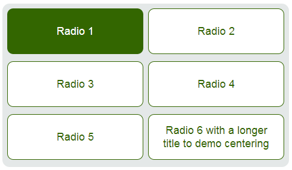
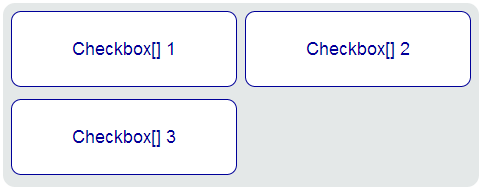
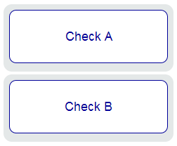

zInput
=========

This jQuery plugin turns your plain checkboxes and radio buttons (with title attributes) into elements that are easily clickable.

Each input can be easily styled within the stylesheet and automatically vertically centers the title

Radio Inputs
----

Radio inputs toggle easily between classes. .zInput and .zSelected.

Checkboxes with same name
-----------
Checkboxes with the same name (i.e. name="check[]") are included in the same outer wrapper for clear usability.

Uniquely named checkboxes
--------------
Uniquely named checkboxes come with their own outer wrapper.

Implemented fastclick.js
--------------
The external repo [fastclick](https://github.com/ftlabs/fastclick/) has been implemented for faster performance on mobile devices.

Usage
--------------
Apply it to a selected parent's children:

`$("#affected").zInput();`

Or apply the function to the whole document:

`$("*").zInput();`

License
----

MIT
