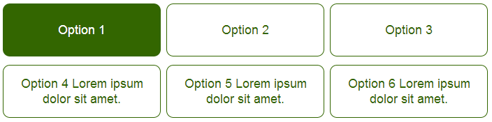

zInput
======

A jquery plugin to transform standard HTML radio buttons (with title attributes) into easily clickable elements.



This is how the buttons look with the default stlyesheet.

Do it with one simple function
```
$("*").zRadio();
```
